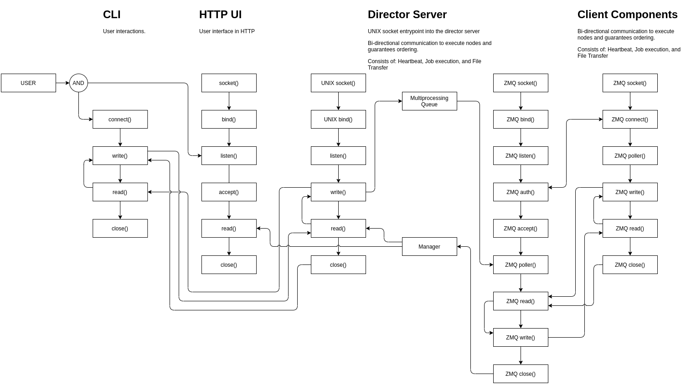

# Director

A deployment framework built to manage the data center life cycle.

Director is a messaging based asynchronous deployment and operations platform
with the aim to better enable faster time to delivery and consistency.

## Makeup

Director is a single application which consists of three parts:

* **Server** - The server is the centralized manager of all communication and
  application delivery.

* **Client** - The client is the minimal application required for enrolling a
  node into a given cluster.

* **User** - CLI utility which interfaces with the server over a local socket
  connect.

Director allows for the user to configure the application using environment
variables, a configurations file, or command line switches.

> NOTE: Because the user interface communicates with the server over a UNIX
  socket, the User and Server components are assumed to exist on the same
  machine.



### Messaging

The cluster messaging uses a router format which ensures it has bi-directional
communication to and from the nodes. The router allows us to create a low
latency mesh which monitors node health and ensures is highly responsive
instruction delivery network.

### User facing DSL

When interacting with the **User** CLI utility executive and orchestration
operations follow a simple DSL inspired by the `Containerfile` specification.

> The AIM of Director isn't to create a new programing language, it is to get
  things done, and then get out of the way.

#### Verbs

This is a short list of the available verbs.

##### `RUN`

Syntax: `STRING`

Execute a command. The client terminal will execute using `/bin/sh`.

Extra arguments available to the `RUN` verb.

`--stdout-arg STRING` - Sets the stdout of a given command to defined cached
argument.

##### `ARG`

Syntax: `KEY VALUE`

Sets a cached item within the environment.

##### `ENV`

The same as `ARG`.

##### `ADD`

syntax: `SOURCE DESTINATION`

Copy a file or glob of files to a remote system. This method allows
operators to define multiple files on the CLI using the specific file, or a
glob of files within a given path.

> When copying multiple files, ensure that the destination path ends with an
  operating system separator.

Extra arguments available to the `ADD` verb.

`--chown user[:group]` - Sets the ownership of a recently transferred file to
a defined user and group (optionally).

`--blueprint` - The blueprint option instructs the client to read and render
a copied file. The file will be rendered using cached arguments.

##### `COPY`

The same as `ADD`.

##### `WORKDIR`

Syntax: `STRING`

Create a directory on the client system.

##### `CACHEFILE`

Syntax: `STRING`

Read a **JSON** or **YAML** file on the client side and load the contents into
argument cache. While cached arguments can easily be defined using the `ARG` or
`ENV` verb, the `CACHEFILE` verb provides a way to load thousands of arguments
using a single action.

#### Extra options

Every job has the ability to skip a cache hit should one be present on the
client node. To instruct the system to ignore all forms of cache, add the
`--skip-cache` to the job definition.

``` shell
$ director exec --verb RUN '--skip-cache echo -e "hello world"'
```

Every job can also be executed only one time. This is useful when orchestrating
a complex deployment where service setup only needs to be performed once. Use
the `--run-once` flag in your command to ensure it's only executed one time.

``` shell
$ director exec --verb RUN '--run-once echo -e "hello world"'
```

### Management

The **User** CLI provides for cluster management and insight into operations.
These functions allow operators to see and manipulate job and node status within
the cluster.

## UI

The server component of director provides for a minimal read-only UI which
provides insight into job executions and nodes within the cluster. To start
the UI component use the `--run-ui` flag when starting the server.

## Orchestration file specification

Orchestration files allow director to run any number of jobs against a given
set of targets. The specification file is simple and made to be easy. Each
file is loaded as an array and can contain many jobs.

The values available within an orchestration file are `targets` and `jobs`.

* `targets` is an array of strings.

* `jobs` is an array of hashes.

``` yaml
---
- targets: []
  jobs: []
```

Within the orchestration file the "target" key is optional. If this key is
undefined, Director will run against all available targets.

``` yaml
---
- jobs: []
```

Running jobs requires each item be a key=value pair. The key is a VERB used for
the given command and the value is the execution.

``` yaml
---
- jobs:
  - RUN: "echo hello world"
```

> Several CLI options are available when orchestrating a deployment, such as
  `--restrict` and `--ignore-cache`. These option provide for the ability to
  replay specific tasks or forcefully ignore the client side cache.

##### Example Orchestration file

This example orchestration file will copy the local client ssh keys from the
directory `/home/centos/.ssh` to all nodes within the clister. Then, on the
three noted targets, `wget` will be installed.

``` yaml
---
- jobs:
  - WORKDIR: /home/centos/.ssh
  - RUN: chmod 600 /home/centos/.ssh/* && chmod 700 /home/centos/.ssh
  - ADD: --chown=centos:centos /home/centos/.ssh/* /home/centos/.ssh/
- targets:
  - df.next-c1.localdomain-client-1
  - df.next-c2.localdomain-client-1
  - df.next-c3.localdomain-client-1
  jobs:
  - RUN: dnf install -y wget
```

Upon the execution of each job, a new UUID will be presented to you for
tracking purposes. This information can be used with the manage commands.

## Service setup

Director comes with the ability to pre-create systemd service unit files when
required. When director is installed two additional entrypoints are created for
`director-server-systemd` and `director-client-systemd`. These utilities will
create relevant service unit files and ensure the execution path is set
correctly. This allows operators to easily install and run Director, even when
executing from a virtual-environment.

The service unit, for both server and client, assumes that all configuration
will be performed through the `/etc/director/config.yaml` file. This
configuration file maps all arguments that can be defined on the CLI to is a
simple key=value pair.

##### Example configuration file

``` yaml
---
heartbeat_interval: 1
debug: true
```

## Containerization

A Containerfile and image has been provided allowing operators to run the
Server and Client components within a container. While containerization
functions and is a great tool for development and test, it is recommended
to only run the **Server** component within a container in production scenarios.

#### Pre-built containers are available

Pre-built Director images are available on my the major public registries.

##### Github Package

``` shell
$ podman login https://docker.pkg.github.com -u $USERNAME
$ podman pull docker.pkg.github.com/cloudnull/director/director:main
```

##### Quay.io

``` shell
$ podman pull quay.io/cloudnull/director
```

##### Dockerhub

``` shell
$ docker pull cloudnull/director
```

#### Building the container

``` shell
$ podman build -t director -f Containerfile
```

#### Running the container in Server mode

When running Director in server mode two things need to happen.

1. Create a volume for the container to access local artifacts.

2. Create a volume for the client to access the server socket.

``` shell
mkdir -p ~/director

$ podman run --hostname director \
             --name director-server \
             --net=host \
             --env DIRECTOR_MODE=server \
             --env DIRECTOR_SHARED_KEY=secrete \
             --volume /tmp:/tmp \
             --volume ${HOME}/director:${HOME}/director \
             --detach \
             director director
```

> NOTE: the volume `--volume ${HOME}/director:${HOME}/director` is specifically
  using the full path so that the file system structure within the server mirrors
  that of the local file system. This is important when working with artifacts
  that are not native to the container.

When using this example you can move content into the `~/director` home folder
and access the server socket via `~/director/tmp`.

> Operators following this example will need to copy content on the local
  system into `~/director` before running jobs that assume read access to
  artifacts; such as exec `COPY` or `ADD` jobs and all orchestrations.

Example local client action using a containerized server.

``` shell
$ director --socket-path /tmp/director.sock manage --list-nodes
```

#### Running the container in Client mode

``` shell
$ podman run --hostname $(hostname)-client \
             --name director-client \
             --net=host \
             --env DIRECTOR_SERVER_ADDRESS=172.16.27.120 \
             --env DIRECTOR_SHARED_KEY=secrete \
             --user 0 \
             --detach \
             director director
```

> NOTE: the DIRECTOR_SERVER_ADDRESS environment variable needs to point to the
  IP address or Domain name of the Director server.

#### Touchless Operations

Because the server can be containerized it is possible to run Director on any
container servicing environment without having to officially install the
application on the local system using conventional packages. Interfacing with a
container can be done in an almost endless number of ways. In the following
example a shell function is used to exec into a running `director-server`
container and interface with the client.

``` shell
function director() {
  podman exec -ti director-server /director/bin/director --socket-path /tmp/director.sock $@;
}
```

> Running *Touchless* with the above container invocations still assumes that
  the working path, where artifacts can be read or written, is `~/director`.

## Testing Interactions

Lots of client containers can be created to test full scale interactions. This
simple example shows how that could be done on a single machine.

``` shell
# Pull the director container from quay
$ podman pull quay.io/cloudnull/director

# Start the server
$ director --debug --shared-key secrete server --bind-address 127.0.0.1 &

# Run 40 client containers
$ for i in {1..40}; do
  podman run --hostname $(hostname)-client-${i} \
             --name $(hostname)-client-${i} \
             --net=host \
             --env DIRECTOR_SERVER_ADDRESS=127.0.0.1 \
             --env DIRECTOR_SHARED_KEY=secrete \
             --user 0 \
             --detach \
             director director
done
```

Once running the clients will connect to the server which will stream log
output.

#### Running the functional tests

With Director running, with at least one client, the functional test
orchestration file can be used to exercise the entire suit of tooling. For the
functional tests to work the will need to be executed from the "orchestrations"
directory within the local checkout of this repository.

``` shell
$ director orchestrate functional-tests.yaml --ignore-cache
```

This will run the functional tests and ignore all caching all client nodes when
executing. The reason all caching is ignored is to ensure that the application
is executing what we expect on successive test runs.

Once the test execution is complete, the following oneliner can be used to
check for failure and then dump the jobs data to further diagnose problems.

``` shell
$ (director manage --list-jobs | grep False) && director manage --export-jobs jobs-failure-information.yaml
```

Run the `--purge-jobs` management command to easily clear the job information
before testing again.

``` shell
director manage --purge-jobs
```
