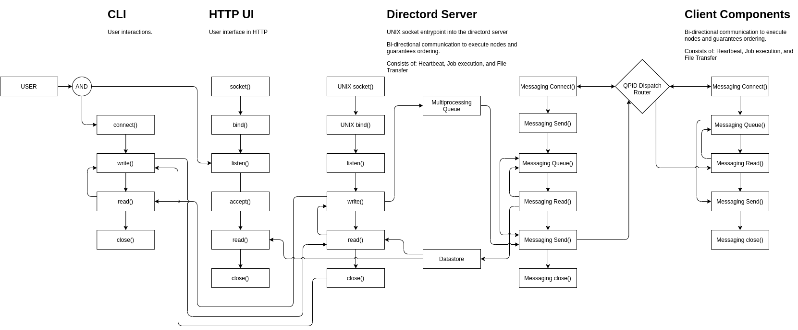
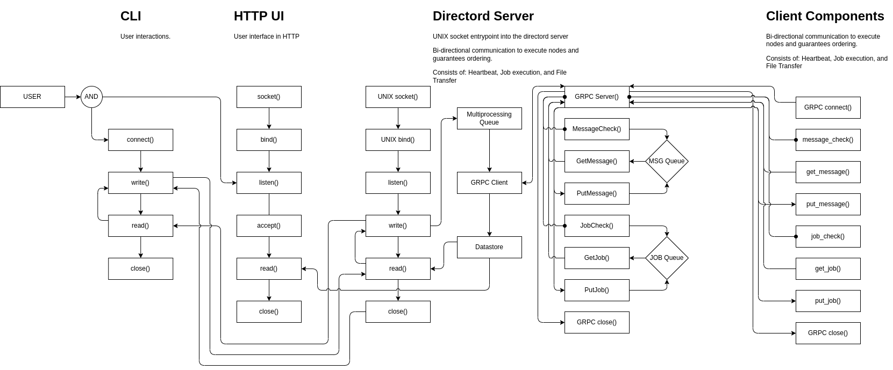

# Messaging Drivers

* TOC
{:toc}

Directord is powered by message platforms. As such, to run Directord a
messaging driver needs to be selected, which may require additional setup
based on the operating environment.

## ZMQ

Status: `Stable`

Used for distributed mesh communication between the server and client nodes.
No additional setup is required outside of the initial package installation.

> The following diagram shows the application flow when using the ZeroMQ
  driver.


Directord with the ZMQ driver supports two forms of authentication, **Shared
Key** and **Curve25519**. Both of these authentication methods enhance the
security of an environment however both methods have some pros and cons.

| Method      | Overview    |
| ----------- | ----------- |
| Shared Key  | Plain Text  |
| Curve25519  | Encryption  |

### Shared Key Authentication

**Shared Key** is the easiest method to setup and only requires a shared token
be generated on all client and server nodes. **Shared Key** is only an
authentication method and does not provide any encryption. While **Shared Key**
is a simple method to setup, it is not recommended to use this method when
dealing with deployments that extend out of a single data center.

**Shared Key** requires only a simple string to be defined within the Directord
configuration file or on the CLI.

Server setup

``` shell
$ directord --zmq-shared-key ${SECRET_TOKEN} server
```

Client Setup

``` shell
$ directord --zmq-shared-key ${SECRET_TOKEN} client
```

### Curve Encryption

**Curve25519** is a more complicated method to setup as keys have to be
generated and synchronized to all client and server nodes. While generating
keys is simple with the `directord --driver zmq server --zmq-generate-keys` command,
the **Curve25519** method is called out as more complex due to the requirement
of file transfers. **Curve25519** will encrypt the traffic within the cluster
making it suitable for deployments that extend beyond a single data center.

> When starting Directord, both on the server and client, if a keys are directed
  and no other authentication method is provided **Curve25519** will be enabled
  automatically.

Example key generation, and synchronization to client nodes.

The following command will generate the encryption keys required to enable
**Curve25519**.

``` shell
$ directord --driver zmq server --zmq-generate-keys
```

> If the `--zmq-generate-keys` command is run more than once it will backup old key
  files before creating new ones. This is important for rollback capabilities
  should that be needed.

This example shows what needs to be created on remote (client) nodes and which
files need to be synchronized to client hosts.

``` shell
$ ssh root@${REMOTE_NODE} "mkdir -p /etc/directord/private_keys /etc/directord/public_keys"
$ rsync -avz /etc/directord/private_keys/client.key_secret root@${REMOTE_NODE}:/etc/directord/private_keys/
$ rsync -avz /etc/directord/public_keys/*.key root@${REMOTE_NODE}:/etc/directord/public_keys/
```

Once the keys are all in place the server can be started using the following command.

``` shell
$ directord --zmq-curve-encryption server
```

It is also possible to upgrade an existing, un-encrypted, deployment to an
encrypted one using the provided orchestration file, `sync-curve-keys.yaml`.
This orchestration file assumes keys have been generated on the server.

``` shell
$ directord orchestrate sync-curve-keys.yaml
```

> This orchestration file will push key files to all nodes within the cluster.
  This can be restricted by setting targets within the orchestration file or
  defining a restriction on the CLI. Once files are synchronized the client
  will need to be configured and restarted.

#### Curve Key Rotation

When encryption is enabled it is important to be able to rotate keys and
restart services whenever required. Directord makes this simple using both its
built in functions and via a
[bootstrap catalog](installation.md#encryption-key-rotation-and-restarting).

To rotate encryption keys natively the following execution commands can be
run, which will first generate new keys on the server and run a simple
orchestration to rotate the keys across an active cluster.

``` shell
$ directord --driver zmq server --zmq-generate-keys
$ directord orchestrate key-rotation.yaml
```

After key rotation you can validate that all nodes are checking into the
cluster using a simple check

``` shell
$ directord manage --list-nodes
```

> Learn more about [Orchestrations here](orchestrations.md).

## Messaging

Status: `Stable`

Based on OSLO messaging and can make use of many messaging backends. For the
purpose of this example, the environment will be configured to use the QPID
dispatch router.

> The following diagram shows the application flow when using the Messaging
  driver.



### Configuration

With the Directord needs to be configured to run with the `messaging` driver.
To do this configuration edit the `/etc/directord/config.yaml` file and add
the following options.

```yaml
driver: messaging
zmq_server_address: 127.0.0.1
```

> NOTE: The server address is the location of the AMQP Server and can be
  anywhere, so long as Directord and the client targets are able to
  router to the defined location.

### Requirements

Before running the `messaging` driver, `qdrouterd` needs to be setup within the
environment.

### Running a local QPID Dispatch Router

``` shell
$ sudo dnf install qpid-dispatch-router
```

Once the dependecies are installed, enable and start the server process.

``` shell
$ sudo systemctl enable qdrouterd.service
$ sudo systemctl start qdrouterd.service
```

### Encryption with SSL

Encryption with SSL can be used to encrypt messages when using the `messaging`
driver.

#### Automatic configuration with bootstrap

A script is included with Directord at
`tools/scripts/messaging/messaging-ssl-setup.sh` that can be used to
automatically configure SSL. The script is used if the
`tools/directord-dev-bootstrap-messaging-catalog.yaml` bootstrap catalog is
used.

The script uses `certmonger` and the locally configured CA on the Directord
server to issue certificates. The script is for development use only and not
intended for production.

#### Manual configuration

SSL configured can be configured manually with the following steps.

1. Configure a CA

    Obtain a CA certifcate and key that can be used to sign other certificates
    needed by Directord. Configure the path to the CA with the
    `--messaging-ssl-ca` argument or configuration file option.

2. Configure Directord certificate and key

    Generate a certificate and private key pair for the Directord server and
    sign it with the configured CA. The Subject CN of the certificate should
    match the hostname of the server, or the value of the `--zmq-server-address`
    configuration used by the clients to connect to the server.

    Specify the path to the server certificate and key with the
    `--messaging-ssl-cert` and `--messaging-ssl-key` arguments or
    configuration file options when starting the Directord server.

3. Configure Directord client certificates and keys

    Generate a certificate and private key pair for each Directord client and
    sign them with the configured CA. The Subject CN should match the client
    hostname.

    Copy the client certificate and key to each respective Directord client
    and specify the path to them with the `--messaging-ssl-cert` and
    `--messaging-ssl-key` arguments or configuration file options when starting
    the Directord client.

4. Configure qdrouterd for SSL

    Generate a certificate and private key pair for use with qdrouterd. The
    Subject CN should match that of the host running qdrouterd. Sign the
    certificate with the CA.

    Configure `/etc/qpid-dispatch/qdrouterd.conf` for SSL. See [qdrouterd
    configuration](https://qpid.apache.org/releases/qpid-dispatch-1.17.0/man/qdrouterd.conf.html)
    for complete details on configuring qdrouterd. An `sslProfile` section
    needs to be configured, and the `sslProfile` attribute in the `listener`
    section needs to reference the `sslProfile` section.

    An example, which uses the default values for Directord is shown below:

		sslProfile {
			name: my-ssl
			caCertFile: /etc/pki/ca-trust/source/anchors/cm-local-ca.pem
			certFile: /etc/qpid-dispatch/qdrouterd.conf
			privateKeyFile: /etc/qpid-dispatch/qdrouterd.conf
		}

		listener {
			sslProfile: my-ssl
			host: 0.0.0.0
			port: 20102
            authenticatePeer: false
            requireSSL: true
			saslMechanisms: ANONYMOUS
		}

## GRPC

Status: `Default`

A gRPC server is used to handle message queues between the server and client
nodes.  No additional service setup is required outside of the initial
package installation as the server is managed within Directord.  Optional
configuration for TLS and authentication may be required for certificate
generation.

> The following diagram shows the application flow when using the GRPCD
  driver.



### Configuration

With the Directord needs to be configured to run with the `grpcd` driver.
To do this configuration edit the `/etc/directord/config.yaml` file and add
the following options.

```yaml
driver: grpcd
grpc_server_address: 127.0.0.1
```

This configuration enables the grpc server to listen on `0.0.0.0` and connect
to `127.0.0.1`.  External clients will need to have `grpc_server_address`
configured to use the server's IP address or hostname.

#### Additional options

Additional configuration options are available with the `grpcd` driver.

* `--grpc-port` (`grpc_port`) **INTEGER** gRPC server port. Default: 5558
* `--grpc-server-address` (`grpc_server_address`) **STRING** gRPC Domain or IP address of the server to connect to. Default: 127.0.0.1
* `--grpc-disable-compression` (`grpc_disable_compression`) **BOOLEAN** Disable compression between client and server. Default: False
* `--grpc-bind-address` (`grpc_bind_address`) **STRING** IP address to bind to when starting up the server. Default: 0.0.0.0
* `--grpc-server-workers` (`grpc_server_workers`) **INTEGER** Number of gRPC server workers. Default: 4
* `--grpc-ssl` (`grpc_ssl`) **BOOLEAN** Enable gRPC server TLS encruption. Default: False
* `--grpc-ssl-ca` (`grpc_ssl_ca`) **STRING** gRPC driver SSL CA file path. Default: /etc/pki/ca-trust/source/anchors/cm-local-ca.pem
* `--grpc-ssl-cert` (`grpc_ssl_cert`) **STRING** gRPC driver SSL certificate path. This file on the server is used as the server SSL certificate. On the client it is used for authentication when SSL Client Authentication is enabled. Default: /etc/directord/grpc/ssl/directord.crt
* `--grpc-ssl-key` (`grpc_ssl_key`) **STRING** gRPC driver SSL certificate key path. This file on the server is used as the server SSL certificate key.  On the client it is used for authentication when SSL Client Authentication is enabled. Default: /etc/directord/grpc/ssl/directord.key
* `--grpc-ssl-client-auth` (`grpc_ssl_client_auth`) **BOOLEAN** Require SSL Client Authenticaiton. If this is enabled, `grpc_ssl_cert` and `grpc_ssl_key` are required on the clients. Default: False

### Encryption with TLS

Encryption with TLS can be used to encrypt messages when using the `grpcd` driver.

#### SSL Client Authentication

Authentication using client side SSL certificates can be used with the `grpcd`
driver.  When `grpc_ssl_client_auth` is set to `True` on the server, clients
must be configured with `grpc_ssl_cert` and `grpc_ssl_key` to be able to connect
to the server. If `grpc_ssl` is set to `True` and `grpc_ssl_client_aith` is set
to `False` on the server, clients only need to have the `grpc_ssl_ca` configured.

#### Automatic configuration with bootstrap

Similar to the `messaging` driver, bootstrap scripts have been created to aide
in generation of SSL CA and certificate generation.  A script is included with
Directord at `tools/scripts/grpcd/grpcd-ssl-setup.sh` that can be used to
automatically configure SSL.  The script is used if the
`tools/directord-dev-bootstrap-grpc-ssl.yaml` bootstrap catalog is used.

The script uses `openssl` to generate a local CA and certificates for
encryption and authentication.

#### Manual Configuration

1. Configure a CA

   Obtain a CA certifcate and key that can be used to sign other certificates
   needed by Directord.  A CA is necessary to sign certificates to use fori
   client authentication. If client authentication will not be used but TLS is
   used to encrypt the trafic, only the certificate is required.

2. Configure Directord server certificate and key.

   Generate a certificate (or cetificate request) and key pair for the
   Directord server. If using self signed CA, sign the certificate with
   the CA. The Subject CN of the certificate should match the hostname
   of the server or the value of `--grpc-server-address` (`grpc_server_addres`).

   Specific the path to the server certificate and key with the
   `--grpc-ssl-cert` (`grpc_ssl_cert`) and `--grpc-ssl-key` (`grpc_ssl_key`)
   arguments or configuration file options when starting the Directord server.

3. Configure Directord client CA, certificate, and key.

   On the client use `--grpc-ssl` (`grpc_ssl`) to enable ssl. The CA option
   `--grpc-ssl-ca` (`grpc_ssl_ca`) should be configured with the path to the
   CA certificate.

   If SSL Client Authentication is enabled, the `--grpc-ssl-cert`
   (`grpc_ssl_cert`) and `--grpc-ssl-key` (`grpc_ssl_key`) must be configured
   for the client to be able to connect to the server. If SSL Client
   Authentication is not enabled, the options can be skipped.

