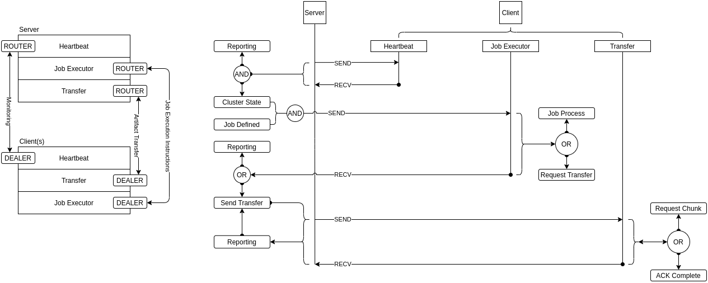

# Directord Components

* TOC
{:toc}

Directord is a single application which consists of three parts:

* **Server** - The server is the centralized manager of all communication and
  application delivery.

* **Client** - The client is the minimal application required for enrolling a
  node into a given cluster.

* **User** - CLI utility which interfaces with the server over a local socket
  connect.


## Cluster Messaging

The cluster messaging uses a router format which ensures it has bi-directional
communication to and from the nodes. The router allows us to create a low
latency mesh which monitors node health and ensures is highly responsive
instruction delivery network.



The application flow has been built to best enable asynchronous operations,
easily scaling to hundreds of clients without impacting throughput. While the
User is expected to interact with the system via CLI, Directord does provide
bindings for programable interfaces.

## Management

The **User** CLI provides for cluster management and insight into operations.
These functions allow operators to see and manipulate job and node status within
the cluster.

### Data storage and persistance

Directord has two modes of operation for data-storage and persistence.

* Ephemeral mode, only retain cluster and job information so long as the server
  process is running.

> If the datastore option is set to **memory**, the server will spawn a manager
  thread to facilitate the document store.

* Persistent mode, datastore using external datastore; supported datastores
  are: Redis and File. The datastore option available in both config, or on the
  CLI and uses a standard RFC-1738 compatible string. This allows operators to
  connect to different storage backends to suit their environment needs.

> Storing information persistently introduces a dependency on an external
  system and creates latency. While the latency should be minimal, and have
  nearly no impact on task execution, it is something that needs to be considered
  when constructing the cluster topology. Inversely, using an external datastore
  will lower the memory utilization of Directord and can have a profound effect
  on deployment node requirements; this is especially true at hyper-scale.

> The `datastore` option has three potential drivers, **memory**, **file**,
  or **redis**.

| Datastore               | Configuration (/etc/directord/config.yaml) |
| ----------------------- | ------------------------------------------ |
| disc                    | file:///var/cache/directord                |
| redis                   | redis://127.0.0.1:6379/4                   |
| memory (default)        | memory                                     |

#### Profiling

Every Directord task is profiled. The execution and the round trip time are
stored and made available when inspecting jobs. This builtin profiling allows
operators to better understand their deployment workloads.

* ROUNDTRIP_TIME: Time taken from task transmit to return. The server will
  timestamp every task when spawned, and will store the delta when the return
  data is received by the server.

* EXECUTION_TIME: Time taken to run a particular task. The client will
  timestamp every task before execution and return the delta once the task
  exits.

To further understand deployment characteristics, Directord also provides an
*analyze* function which will allow operators to dig deeper into their data.
The job and parent analyze functions will highlight outliers, node
discrepancies, failures, and performance for entire orchestrations.

``` shell
$ sudo /opt/directord/bin/directord orchestrate ~/directord/tests/comparison-orchestration.yaml --target directord-{0..5} --wait

# Note the ID used in this command is the "Parent" UUID for a given orchestration
$ sudo /opt/directord/bin/directord manage --analyze-parent fd9c7387-de10-420f-92fe-2ac0a4716c8d
KEY                       VALUE
------------------------  ------------------------------------
ID                        fd9c7387-de10-420f-92fe-2ac0a4716c8d
ACTUAL_RUNTIME            18.774806261062622
COMBINED_EXECUTION_TIME   61.2486093044281
FASTEST_NODE_EXECUTION    directord-2
FASTEST_NODE_ROUNDTRIP    directord-2
SLOWEST_NODE_EXECUTION    directord-0
SLOWEST_NODE_ROUNDTRIP    directord-0
TOTAL_AVG_EXECUTION_TIME  0.0612486093044281
TOTAL_FAILURES            0
TOTAL_JOBS                1000
TOTAL_NODE_COUNT          6
TOTAL_SUCCESSES           6000

Total Items: 12
```
